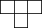
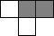

# FC-DiscreteCart

Discrete logic Famicom / Dendy cartridge PCB.

The following board types are supported:  
NROM, CNROM, GNROM, BNROM, AMROM, ANROM, AOROM, UNROM, UOROM.

Russian version: [`README.ru.md`](README.ru.md)

## Jumper configuration

All jumpers except JP1 are set according to the table below.  
JP1 (VRAM_A10) selects PPU nametable mirroring — see the note after the table.

| ROM type | U1* type | U2 type | U3 74161 | U4 7432 | U5 7402 | JP1 VRAM_A10 | JP2 PRG_OE | JP3 CHR_PIN26 | JP4 CHR_PIN27 | JP5 161_Q2 | JP6 161_Q3 | JP7 PRG_A14 | JP8 PRG_A15 | JP9 PRG_A15 | JP10 PRG_A16 | JP11 PRG_A16 | JP12 PRG_A17 |
| :--- | :--- | :--- | --- | --- | --- | --- | --- | --- | --- | --- | --- | --- | --- | --- | --- | --- | --- |
| NROM | ROM 16kB/32kB | ROM 8kB | ✗ | ✗ | ✗ | V/H\*\* |  |  |  |  |  |  |  |  |  |  |  |
| CNROM | ROM 16kB/32kB | ROM 32kB | ✓ | ✗ | ✗ | V/H\*\* |  |  |  |  |  |  |  |  |  |  |  |
| GNROM | ROM 128kB | ROM 32kB | ✓ | ✗ | ✗ | V/H\*\* |  |  |  |  |  |  |  |  |  |  |  |
| AMROM | ROM 128kB | RAM 8kB | ✓ | ✗ | ✗ |  |  |  |  |  |  |  |  |  |  |  |  |
| ANROM / AOROM | ROM 128kB/256kB | RAM 8kB | ✓ | ✗ | ✓ |  |  |  |  |  |  |  |  |  |  |  |  |
| BNROM | ROM 128kB | RAM 8kB | ✓ | ✗ | ✗ | V/H\*\* |  |  |  |  |  |  |  |  |  |  |  |
| UxROM | ROM 256kB | RAM 8kB | ✓ | ✓ | ✗ | V/H\*\* |  |  |  |  |  |  |  |  |  |  |  |

\* `U1`: for NROM/CNROM, ICs in `DIP-28` or `DIP-32` packages can be used.

\*\* JP1 (VRAM_A10) depends on the required PPU nametable mirroring:

| Mirroring | JP1 position |
| --- | --- |
| Vertical |  |
| Horizontal |  |

## License

This project is licensed under **CERN Open Hardware Licence Version 2 – Permissive** (`CERN-OHL-P-2.0`).  
See `LICENSE` for details.

SPDX-License-Identifier: `CERN-OHL-P-2.0`
